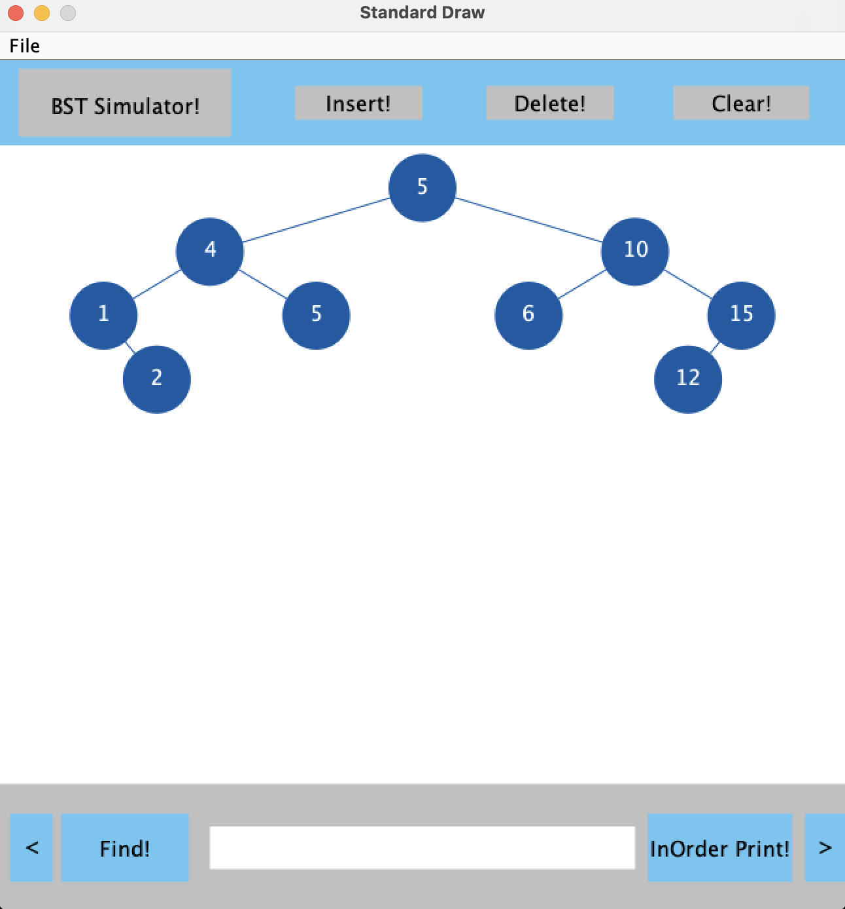

# Binary Tree Visualizer



## Overview

The Binary Tree Visualizer is a sophisticated Java-based application engineered to provide a dynamic, real-time visualization of a Binary Search Tree (BST). Developed as a tool for both educational and analytical purposes, it offers a robust graphical interface that allows users to interact with the data structure and observe the immediate impact of their operations. The application is designed to demystify complex BST algorithms by animating node insertions, deletions, searches, and traversals, making it an effective learning and demonstration tool.

This project showcases a strong foundation in data structures, algorithms, and object-oriented design principles. It was built with modularity and extensibility in mind, separating the core BST logic from the user interface and file I/O components.

## Core Features & Technical Highlights

-   **Dynamic & Interactive GUI:** The graphical user interface, built from the ground up using the `StdDraw` library, provides a clean and intuitive platform for all user interactions.
-   **Algorithmic Animation:** Key BST operations are animated to provide a clear, step-by-step illustration of the underlying algorithms. This includes:
    -   **Node Insertion:** Visualizes the traversal path to identify the correct position for a new node.
    -   **Node Deletion:** Clearly demonstrates the process of removing a node, including the logic for handling nodes with zero, one, or two children and finding the in-order successor.
    -   **Node Searching:** Animates the search path, highlighting each node visited until the target value is located.
-   **Advanced Tree Traversals:** The application supports and animates three fundamental tree traversal methods, providing both a visual and textual representation of the output:
    -   In-Order Traversal
    -   Pre-Order Traversal
    -   Post-Order Traversal
-   **Data Persistence:** Key performance metrics and structural data, such as traversal orders and tree height, can be exported to a `BSTStatistics.txt` file for later analysis.
-   **Robust Architecture:** The codebase is organized into distinct classes (`BST`, `UI`, `FileIO`), each with a single responsibility, promoting code clarity, maintainability, and scalability.

## How to Run

1.  **Prerequisites:**
    *   Java Development Kit (JDK) 8 or higher.
    *   Apache Maven.

2.  **Execution:**
    *   Clone the repository and navigate to the project's root directory.
    *   Compile and package the application by running:
        ```sh
        mvn install
        ```
    *   Execute the application using the following command:
        ```sh
        mvn exec:java
        ```

## Usage Guide

-   **Input:** Enter an integer into the input field located at the bottom of the application window.
-   **Insert:** Click the "Insert!" button to add the entered number to the tree.
-   **Delete:** Click the "Delete!" button to remove the entered number from the tree.
-   **Find/Export:** Use the toggle buttons on the bottom left to switch between "Find!" and "Export!".
    -   **Find!**: Initiates a search for the entered number.
    -   **Export!**: Saves the current tree's traversal data and height to `BSTStatistics.txt`.
-   **Traversals:** Cycle through "inOrder Print!", "preOrder Print!", and "postOrder Print!" using the buttons on the bottom right to visualize different traversal algorithms.
-   **Clear:** The "Clear!" button will reset the tree, removing all nodes.

## File Structure

-   `pom.xml`: Maven project configuration file.
-   `BST Simulator/src/BSTSimulator.java`: The main class and entry point for the application.
-   `BST Simulator/src/UI.java`: Manages all graphical user interface components and handles user input.
-   `BST Simulator/src/BST.java`: Implements the core Binary Search Tree data structure and its associated algorithms.
-   `BST Simulator/src/FileIO.java`: Handles the logic for writing tree statistics to an output file.
-   `demo.png`: A demonstration image of the application in action.
-   `README.md`: This file.
